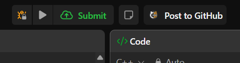
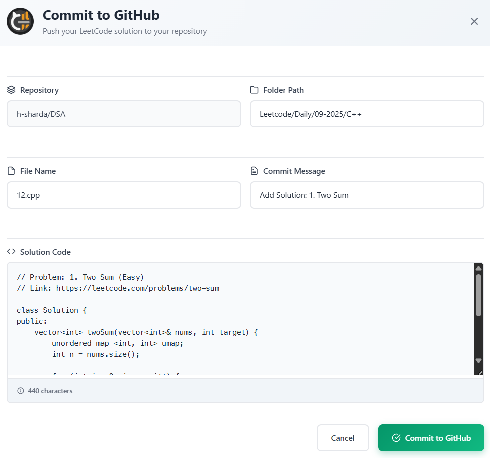

# </img> LeetCode to GitHub

A Chrome extension that automatically syncs your LeetCode solutions to your GitHub repository, helping you maintain both your LeetCode and GitHub streaks simultaneously.

## Features

- **One-Click Sync**: Automatically extract and commit your LeetCode solutions to GitHub
- **Smart File Organization**: Customizable file naming and folder structure with dynamic placeholders
- **Multi-Language Support**: Supports all LeetCode programming languages (C++, Java, Python, JavaScript, TypeScript, etc.)
- **Template System**: Flexible commit messages and file content with dynamic placeholders
- **Secure Authentication**: Uses GitHub Personal Access Token \(stored locally\) for secure repository access
- **Customizable Settings**: Configure default paths, file names, commit messages, and content templates

## How It Works

1. **Solve Problems**: Work on LeetCode problems as usual
2. **Click "Post to GitHub"**: The extension adds a button to LeetCode's interface
   

3. **Automatic Extraction**: Extracts problem details, difficulty, language, and your code
4. **Smart Formatting**: Uses your custom templates to format the commit and file content
5. **Direct Upload**: Commits the solution directly to your GitHub repository
   

## Installation

### From Chrome Web Store

_Coming soon..._

### From GitHub Releases (Recommended)

1. **Download the latest release:**

   - Go to [Releases](https://github.com/h-sharda/Leetcode-To-Github/releases)
   - Download the latest `crx-leetcode-to-github-x.x.x.zip` file

2. **Extract the zip file:**

   - Extract the downloaded zip file to a folder on your computer

3. **Load the extension in Chrome:**
   - Open Chrome and navigate to `chrome://extensions/`
   - Enable "Developer mode" in the top right
   - Click "Load unpacked" and select the extracted folder

### Manual Installation (Build from Source)

1. Clone this repository:

```bash
git clone https://github.com/h-sharda/Leetcode-To-Github.git
cd Leetcode-To-Github
```

2. Install dependencies:

```bash
npm install
```

3. Build the extension:

```bash
npm run build
```

4. Load the extension in Chrome:
   - Open Chrome and navigate to `chrome://extensions/`
   - Enable "Developer mode" in the top right
   - Click "Load unpacked" and select the `dist` directory

## Setup

### 1. GitHub Repository Setup

1. Create a new repository on GitHub (or use an existing one)
2. Generate a Personal Access Token:
   - Go to [GitHub Token Settings](https://github.com/settings/personal-access-tokens)
   - Click "Generate new token (classic)"
   - Give it a descriptive name
   - Select "Only select repositories" and choose your target repository
   - Under "Repository permissions", set "Contents" to "Read and write"
   - Click "Generate token" and copy it

### 2. Extension Configuration

1. Click the extension icon in your browser toolbar
2. Click "Settings" to open the configuration page
3. Enter your GitHub credentials:
   - **GitHub Username**: Your GitHub username
   - **Repository Name**: The repository where solutions will be stored
   - **GitHub Token**: The personal access token you created
4. Click "Save Settings" to validate and save your credentials

### 3. Customize Templates (Optional)

Configure how your solutions are organized and formatted:

- **Default Path**: Folder structure (e.g., `Leetcode`, `Solutions/<DIFFICULTY>`)
- **Default File Name**: File naming pattern (e.g., `<DD-MM-YYYY>_<PROBLEM_NO>`)
- **Default Commit Message**: Commit message template (e.g., `Add Solution: <PROBLEM_NO>. <PROBLEM_NAME>`)
- **Default Content**: File content template with problem details and code

## Dynamic Placeholders

Use these placeholders in your templates to automatically insert dynamic content:

| Placeholder      | Description                           |
| ---------------- | ------------------------------------- |
| `<DD-MM-YYYY>`   | Current date (DD-MM-YYYY)             |
| `<DD-MM>`        | Current date (DD-MM)                  |
| `<MM-YYYY>`      | Current date (MM-YYYY)                |
| `<MM-YY>`        | Current date (MM-YY)                  |
| `<DD>`           | Current day                           |
| `<URL>`          | LeetCode problem URL                  |
| `<PROBLEM_NAME>` | Problem name                          |
| `<PROBLEM_NO>`   | Problem number                        |
| `<DIFFICULTY>`   | Problem difficulty (Easy/Medium/Hard) |
| `<LANG>`         | Programming language                  |
| `<CODE>`         | Your solution code                    |

## Usage

1. **Navigate to any LeetCode problem**: Go to `https://leetcode.com/problems/[problem-name]`
2. **Solve the problem**: Write your solution in the code editor
3. **Click "Post to GitHub"**: The extension button appears in the LeetCode interface
4. **Review and commit**: A modal will show the formatted content - review and click "Commit to GitHub"

## Project Structure

```
src/
├── popup/           # Extension popup UI
├── content/         # Content scripts for LeetCode integration
│   └── views/       # React components for LeetCode interface
├── options/         # Extension settings page
├── background/      # Background service worker
└── public/          # Static assets (logo, injected scripts)
```

### Development Notes

- The extension uses CRXJS Vite plugin for seamless Chrome extension development
- Content scripts are injected into LeetCode pages to add the "Post to GitHub" button
- The extension communicates with GitHub API using Personal Access Tokens
- All user settings are stored locally using Chrome's storage API

## Contributing

1. Fork the repository
2. Create a feature branch: `git checkout -b feature-name`
3. Make your changes and test thoroughly
4. Commit your changes: `git commit -m 'Add some feature'`
5. Push to the branch: `git push origin feature-name`
6. Submit a pull request

## Support

**Issues**: [GitHub Issues](https://github.com/h-sharda/Leetcode-To-Github/issues)

## Acknowledgments

- Built with [React](https://reactjs.org/) and [TypeScript](https://www.typescriptlang.org/)
- Powered by [Vite](https://vitejs.dev/) and [CRXJS](https://crxjs.dev/vite-plugin)
- Inspired by the need to maintain both LeetCode and GitHub streaks simultaneously
